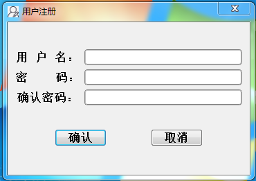
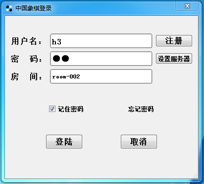
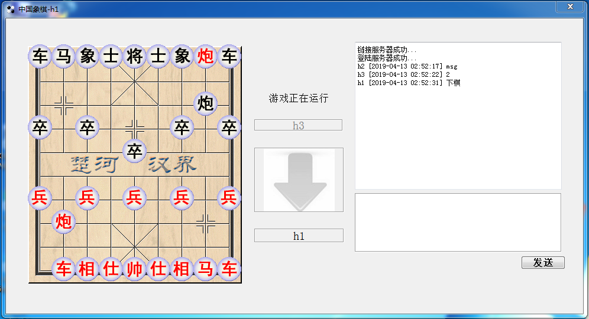

# ChessGame
网络版中国象棋 是一个网络象棋桌, 目前功能有注册、登陆、下棋、聊天四大功能.

## 部分截图




## v2版本特点
* 使用纯go语言重写了服务端逻辑，账号密码使用leveldb储存，不依赖外部数据库，可直接运行在windows、linux的电脑上
* 使用websocket+json进行通信, 相对于二进制协议调试简单，不用手动分包，前端使用nginx代理后不占用对外端口
* 自动从go代码生成协议的序列化、反序列化、c++的class定义，Encode、Decode不用手动操作了
* 客户端使用rpchub与服务端进行通信
  * 对外表现为同步形式的rpc.
    * 客户端可直接注册服务端通知回调函数, 配合c++11 的lamda表达式，处理代码几行搞定
* 支持多个房间

## ChessClient 需要
* qt  >= 5.6
## 引用项目
* 服务端:
    * [websocket](https://github.com/gorilla/websocket )
    * [goleveldb](https://github.com/syndtr/goleveldb)

## nginx代理websocket注意事项
* 真实的ChessServer监听在127.0.0.1:8912位置, nginx配置为
````
server {
    listen       80;
    server_name  example.com;
    location / {
        proxy_pass   http://127.0.0.1:8912;
        proxy_redirect    off;
        proxy_set_header X-Real-IP $remote_addr;
        proxy_set_header Host $host;
        proxy_set_header X-Forwarded-For $proxy_add_x_forwarded_for;

        proxy_http_version 1.1;
        proxy_set_header Upgrade $http_upgrade;
        proxy_set_header Connection "upgrade";
    }
}
````
## 欢迎报告BUG和提交功能需求
