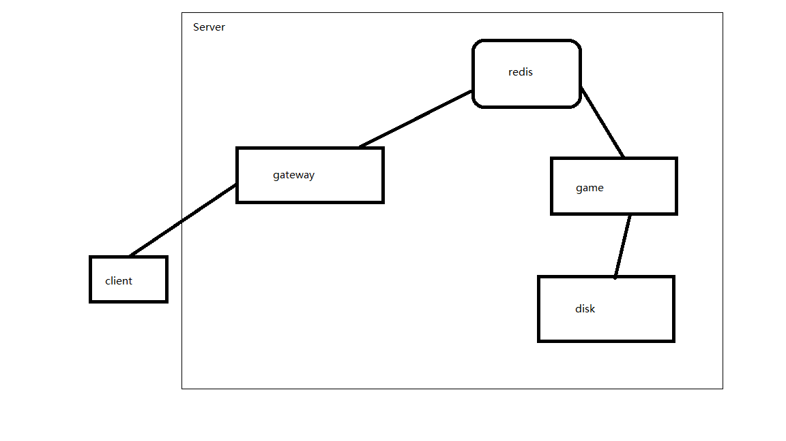

# ChessGame
网络版中国象棋 是一个网络象棋桌, 目前功能有注册、登陆、下棋、聊天四大功能.

## 部分截图


## v2版本特点
* 使用纯go语言重写了服务端逻辑，账号密码使用leveldb储存，不依赖外部数据库，可直接运行在windows、linux的电脑上
* 使用websocket+json进行通信, 相对于二进制协议调试简单，不用手动分包，前端使用nginx代理后不占用对外端口
* 自动从go代码生成协议的序列化、反序列化、c++的class定义，Encode、Decode不用手动操作了
* 客户端使用rpchub与服务端进行通信
  * 对外表现为同步形式的rpc.
    * 客户端可直接注册服务端通知回调函数, 配合c++11 的lamda表达式，处理代码几行搞定
* 支持多个房间

## v2.5版本改进

* 服务端分离为 gateway、game两大模块, 使用redis的list结构传递, 解耦 (类似于d-bus)
      * gateway 的作用是对客户端连接进行代理、数据分包、数据封包、死链接检测、把底层链接抽象为redis里的一条sessionId
	  * game 承载游戏全部逻辑, 只与redis直接通信, 支持客户端无感知的情况下快速重启进程
## ChessClient 需要
* qt  >= 5.6
## 引用项目
* 服务端:
    * [websocket](https://github.com/gorilla/websocket)
    * [goleveldb](https://github.com/syndtr/goleveldb)

## nginx代理websocket注意事项
* 真实的ChessServer监听在127.0.0.1:8912位置, nginx配置为
````
server {
    listen       80;
    server_name  example.com;
    location / {
        proxy_pass   http://127.0.0.1:8912;
        proxy_redirect    off;
        proxy_set_header X-Real-IP $remote_addr;
        proxy_set_header Host $host;
        proxy_set_header X-Forwarded-For $proxy_add_x_forwarded_for;

        proxy_http_version 1.1;
        proxy_set_header Upgrade $http_upgrade;
        proxy_set_header Connection "upgrade";
    }
}
````
## 编译、部署服务端
1. 克隆本仓库代码到本地
  `git clone https://github.com/orestonce/ChessGame`
2. 设置 `GOPATH` 为克隆下来的的目录， 开始编译linux_amd64版服务端程序
  `GOPATH=$(pwd) go run src/BuildServer/main.go`
3. 编译完成，会生产 bin/ChessGame bin/ChessGate 两个二进制文件
4. 部署到服务器: 假设redis地址为127.0.0.1:6379, 服务器地址为ws://192.168.56.111:8912/ChessGame, 部署前缀为chess001
  ````
  # 启动gateway
  ./ChessGate -laddr 192.168.56.111:8912 -raddr 127.0.0.1:6379 -rprefix chess001 -wspath /ChessGame
  # 启动game
  ./ChessGame -raddr 127.0.0.1:6379 -rprefix chess001 -spath /tmp/ChessGame
  ````

## 编译、配置客户端
1. 克隆本仓库代码到本地
  `git clone https://github.com/orestonce/ChessGame`
2. 打开 `src/ChessClient/ChessClient.pro` ，开始编译
  `ctrl + r`
3. 在登陆页面点击 "设置服务器" 按钮, 输入服务器连接地址: `ws://192.168.56.111:8912/ChessGame`, 点击确认
4. 回到登陆页面后，点击注册，输入用户名、密码点击确认即可注册成功
5. 回到登陆页面后，输入用户名、密码点击登陆即可登入刚才在第4步创建的账号
6. 再开启一个客户端进程，重复4, 5步，登陆另一个账号即可和自己玩耍了

## 预编译的客户端、服务端
   * [Go](https://github.com/orestonce/ChessGame/releases)